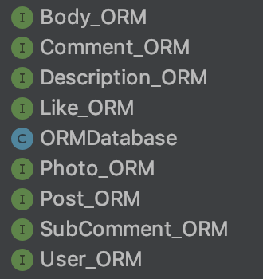
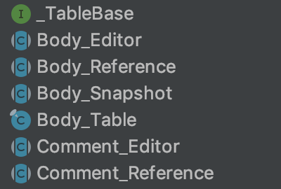
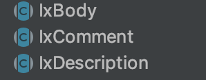
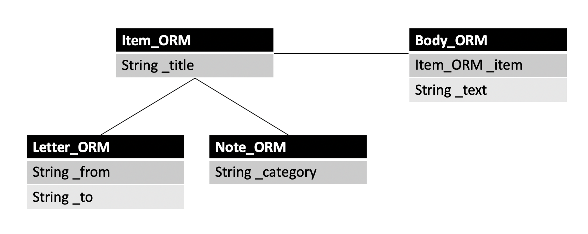

# Storm 

Storm 은 ORM 라이브러리입니다. Storm 의 가장 큰 특징은 멀티스레드 환경에서 동시성, 트랜잭션과 관계되어 발생할 수 있는 문제들를
내부적으로 처리해 Storm 을 사용하는 개발자가 이러한 문제들에 대해 신경쓸 필요가 없다는 점입니다. 현재 Storm 은 JDBC 로 sqlite 를 사용하도록
구현이 되어 있습니다. 업데이트를 통해 다른 데이터베이스를 사용하는 구현체들도 추가할 예정입니다.

Storm 은 쉽고 빠르게 객체를 데이터베이스에 저장합니다. 아래 예제를 확인하세요 :
```java
    // ORMEntity 를 확장하여 모델 정의
    public interface User_ORM extends ORMEntity {
    
        ORMColumn EmailAddress = _Column("_emailAddress", Unique, // "_emailAddress" 를 이름으로 하고 String 을 타입으로 갖는
                String.class);                                    // unique 한 칼럼을 정의합니다.
    
        ORMColumn Name = _Column("_name", 0,
                String.class);
        
        OuterLink Description = _VolatileJoin("_description", 0, // 조인 관계를 정의합니다.
                Description_ORM.class);
        
        // ... more columns
    }
   
    // emailAddress 를 사용해 user 의 reference 를 찾아옵니다.
    IxUser ref = tUser.findByEmailAddress("slowcoder@ggg.com");
    
    // reference 로부터 데이터를 로드합니다.
    IxUser.Snapshot user = ref.loadSnapshot();
    String email = user.getEmailAddress(); // get 함수를 통해 snapshot 으로부터 데이터를 가져올 수 있습니다.
    String name = user.getName();
    
    // snapshot 으로부터 아이템을 편집할 editor 를 얻어옵니다.
    IxUser.Editor editUser = user.editEntity();
    editUser.setEmailAddress("updated@ddd.com"); // 데이터를 편집합니다.
    editUser.setName("new name");
    
    // 조인된 아이템의 editor 를 얻어옵니다.
    IxDescription.Editor editDescription = editUser.editDescription();
    editDescription.setText("new text"); // 데이터를 편집합니다.
    
    editUser.save(); // save 함수를 호출하면 조인된 아이템을 포함한 모든 변경사항을 데이터베이스에 기록합니다. 
    
    // 새로운 아이템을 생성하는 경우 테이블에서 editor 를 얻어옵니다.
    IxUser.Editor newUser = tUser.newEntity();
    
    // 아이템이 변경되었을 때 알림을 받을 수 있습니다.
    ref.setAsyncObserver((entity, type) -> {
    
    });
    
    // 테이블 내의 아이템이 변경되었을 때도 알림을 받을 수 있습니다.
    tUser.addAsyncObserver(noti -> {
        
    });
    
    // 트랜잭션 안에서 데이터베이스 작업을 수행합니다.
    tUser.getDatabase().executeInLocalTransaction(new TransactionalOperation<Object>() {
        @Override
        protected <T> T execute_inTR(Object operationParam, long transactionId) throws SQLException {
            return null;
        }
    }, null);
```

Storm 에 대한 구체적인 설명은 튜토리얼을 참고하세요.

# Dependency

아래의 코드로 Storm 라이브러리를 추가합니다.
```groovy
dependencies {
    // 자바 어플리케이션
    implementation 'org.slowcoders:storm:0.7.0'
    
    //
    implementation 'org.slowcoders:storm-android:0.7.0'
}
```

# 샘플 

Storm 이 어떻게 활용하될 수 있는지 보여주는 샘플 안드로이드 
어플리케이션을 준비했습니다. [샘플 보기](storm-android/sample)


# 튜토리얼

이 튜토리얼에서 우리는 간단한 예제를 통해 Storm 의 사용법을 알아봅니다. 
예제에 사용하는 데이터베이스는 SNS 어플리케이션을 가정하고 만들었습니다.

### ORM 모델 정의

Storm 소스를 생성하기 위해선 우선 ORM 모델을 정의해주어야 합니다.



위는 샘플 프로그램을 위한 ORM 정의들이며 이 클래스들은  org.slowcoders.sample.orm.def 패키지에 선언되어 있습니다.
모델을 정의하는 방법은 "모델" 섹션에서 다루도록 하겠습니다.

### Database 클래스 정의

ORM 정의와 별도로 db 이름, 마이그레이션 등의 부가 정보들을 나타내는 클래스를 하나 더 생성하여야 하며 이 클래스는 ORM 정의와 같은 
패키지 내에 위치해야 합니다. 

```java
    public class ORMDatabase extends JDBCDatabase { // JDBC 를 사용하는 database 클래스인 JDBCDatabase 상속
    
        private static ORMDatabase dbStorage = new ORMDatabase();
        private static final String dbName = "storm-test.db"; // 데이터 베이스의 이름
        private static final int dbVersion = 1; // DB 버전 관리를 위한 숫자 값
    
        private ORMDatabase() {
            super(dbName);
        }
    
        public static abstract class Table<SNAPSHOT extends EntitySnapshot, REF extends EntityReference, EDITOR extends EntityEditor>
                extends JDBCTable<SNAPSHOT, REF, EDITOR> {
    
            public Table(String tableName) {
                super(dbStorage, tableName);
            }
        }
    
        protected StormTable.AbstractEntityResolver createAbstractEntityResolver() {
            return new StormTable.AbstractEntityResolver() {
                @Override
                public StormTable<?, ?, ?> getTable(long id) {
                    return null;
                }
            };
        }
    
        public static void initDatabase() throws Exception {
            try {
                dbStorage.init(dbVersion, migrations);
            }
            catch (Exception e) {
                e.printStackTrace();
            }
        }
    
        private static JDBCMigration[] migrations = new JDBCMigration[] { // 마이그레이션 정의
    
        };
    
    }
```


상속받은 database 클래스는 반드시 static 한 initDatabase() 함수를 정의하고 이 안에서 init() 함수를 통해 초기화를 해주어야 합니다.
init() 함수는 인자로 각각 마이그레이션에 필요한 dbVersion 과 필요한 Miration 구현체의 배열을 받습니다.

AbstractEntityResolver 는 부가기능을 위한 클래스입니다. 만약 상속 구조를 통해 ORM 클래스를 정의하는 경우 필드가 어느 테이블에 존재할 지 알 수 없는 경우가 있습니다.
이 때 rowid 를 이용해 table 을 찾아오도록 할 수 있습니다. 자세한 설명은 **모델** 섹션의 **@TableDefinition** 을 참고하시면 됩니다.

### 소스 생성

ORM 모델과 Database 클래스를 정의하는 작업이 끝났다면 소스를 생성할 수 있습니다.
소스 생성은 ORMGenerator 를 이용합니다.

```java
    public class GenORM extends ORMGenerator {
    
        @Override
        public String getEntityBaseName(Class<?> ormDefinition) { // 기본 이름을 정의하는 부분
            String name = ormDefinition.getSimpleName();
            return name.substring(0, name.indexOf("_ORM")); // 우리가 정의한 _ORM 클래스 이름에서 _ORM 을 제외한 문자열을 이름으로 사용
        }
    
        @Override
        public String getEntityModelName(Class<?> ormDefinition) { // 모델의 이름을 정의하는 부분
            String baseName = getEntityBaseName(ormDefinition); 
            return "Ix" + baseName; // 기본 이름에 prefix 로 "Ix" 가 붙인 문자열을 모델의 이름으로 사용
        }
    
        public static void main(String[] args) {
            try {
                GenORM gen = new GenORM();
                gen.setSchemaPackage(
                        "ORMDatabase", "src/main/java", "org.slowcoders.sample.orm.def" // Database 클래스의 이름과 orm 이 정의된 디렉토리 및 패키지
                );
                gen.setModelOutput( // Storm 클래스들이 생성될 디렉토리와 패키지
                        "src/main/java", "org.slowcoders.sample.orm.gen",
                        "src/main/java", "org.slowcoders.sample.orm.gen"
                );
    
                gen.generateORM(false);
            } catch (Exception e) {
                throw Debug.wtf(e);
            }
        }
```


ORMGenerator 를 상속받은 클래스에선 Storm 클래스의 기본 이름과 Storm 모델의 이름을 정의해주어야 합니다.
각각의 이름들은 추상 함수인 getEntityBaseName, getEntityModelName 에서 정의해주면 됩니다.

그리고 ORM 모델들의 디렉토리와 패키지, 그리고 소스가 생성될 디렉토리와 패키지를 정해준 다음 실행을 하면 소스가 생성됩니다.





...

...

우리가 정의한 ORM 모델들에 대한 Storm 클래스들이 생성됐습니다.

### PALConfig

마지막으로 해주어야할 작업은 어플리케이션에서 Storm 을 사용하기 위한 Config 파일을 구현하는 겁니다.
PAL.Impl 클래스에는 Storm 을 사용하기 위해서 구현해야 하는 Storage, AsyncSchedule.Executor 가 정의되어 있으며
각각은 데이터베이스의 경로, 노티피케이션이 전달될 스레드를 정해주는 클래스들입니다.

```java
    public class PAL {
        
        // ...
           
        public interface Impl {
            Storage getStorage();
    
            NPAsyncScheduler.Executor getAsyncExecutor();
    
            boolean isDebugVerbose();
    
            boolean isDebugMode();
        }
    }
```
    
Config 클래스는 반드시 'org.slowcoders.pal' 패키지 안에 생성되어야 하며
클래스는 이름은 'PALConfig' 로 설정해야 합니다.

[Configs]("https://github.com/slowcoders/mpbase/tree/master/src/pal) 에 PALConfig 의 템플릿이 만들어져 있습니다.
j2se 폴더에는 pc 버전, android 폴더에는 안드로이드 버전이 있으니 복사한 뒤 어플리케이션에 맞게 수정하시면 됩니다.
기본 구현에는 노티피케이션을 ui 스레드에서 보내도록 되어 있습니다. 

### Storm 객체

Storm 에서 사용하는 주요 객체로는 EntityReference, EntitySnapshot, EntityEditor, StormTable 이 있습니다.
각각은 모두 추상클래스로 기본적인 함수들이 정의되어 있으며 사용자가 정의한 각각의 ORM 정의 마다 위의 네 클래스를 상속한 구현체들이 생성됩니다. 위에서 Body_ORM 을 정의한 결과 Body_Editor, Body_Reference, Body_Snapshot. Body_Table 이 생성된 걸 볼 수 있습니다.

**EntityReference** 
reference 는 아이템의 rowid 를 들고 있는 객체이며 들고 있는 rowid 를 통해 데이터를 로드하거나 삭제하는 동작을 수행합니다. 
이 rowid 는 항상 unique 하며 Storm 내부에서는 reference 객체들을 rowid 에 매핑하여 캐싱합니다. 때문에 하나의 아이템에 대한 reference 객체는 반드시 하나만 존재합니다. 

**EntityEditor**

editor 는 새로운 아이템을 만들거나, 기존의 아이템을 수정하기 위한 객체입니다. 각각의 필드를 수정할 수 있는 set__() 함수들이 정의되어 있으며 수정이 완료된 다음에는 save() 함수를 호출해 실제 데이터베이스에 데이터를 저장할 수 있습니다. 

**EntitySnapshot**

snapshot 은 데이터베이스에서 읽어 온 데이터를 갖고 있는 객체입니다. 필드마다 값을 가져올 수 있는 get___() 함수들이 정의되어 있으며 이 값들은 snapshot 이라는 이름에서 알 수 있듯이 snapshot 을 읽어 온 시점의 데이터들 입니다. snapshot 이 들고 있는 데이터들은 철저하게 Immutable 하게 관리됩니다. snapshot 에는 필드 값을 수정할 수 있는 set___() 함수들이 존재하지 않으며 데이터를 수정하기 위해서는 editor 객체를 별도로 얻어 와야 합니다. 이 때에도 기존의 snapshot 객체는 변경되지 않습니다. List, Map 과 같은 자료구조의 경우에도 수정이 불가능한 객체만을 반환합니다.

**StormTable** 

table 은 reference 의 캐시를 관리하며 실제 데이터베이스와의 접근이 필요한 동작들을 수행합니다. ORM 정의에 따라 생성된 table 의 구현체들은 _TableBase 라는 이름의 인터페이스에 모두 정적으로 정의되어 있습니다. 

# 모델

ORM 모델은 ORMEntity 클래스를 상속받아 생성합니다.

```java
    @TableDefinition(
            tableName = "tUser" // 테이블 이름
    )
    public interface User_ORM extends ORMEntity { // ORM 모델은 ORMEntity 클래스를 상속받아야 합니다.
    
    		// Column 선언
        ORMColumn EmailAddress = _Column("_emailAddress", Unique, // String 타입의 unique 한 _emailAddress 칼럼
                String.class);
    
        ORMColumn Name = _Column("_name", 0, // String 타입의 _name 칼럼
                String.class);
    
        OuterLink Posts = _VolatileJoin("_posts", 0, // Post_ORM 과 join 관계 정의. 실제 칼럼은 아님.
                Post_ORM.class);
```

### @TableDefinition

```java
    @TableDefinition(
            tableName = "tUser"
    				rowIdStart = // number for rowIdStart
    )
```

TableDefinition 어노테이션 안에서는 다음과 같은 데이터를 정의해 줄 수 있습니다. TableDefinition 이 정의된 ORM 클래스는 모두 테이블로 데이터베이스에 생성됩니다. 상속 구조를 위해 사용하는 ORM 정의의 경우에 실제 테이블로 생성될 필요가 없으므로 TableDefinition 을 정의해주지 않으면 됩니다.

**tableName** - 이 이름으로 db 에 테이블이 만들어지며 StormTable 의 객체도 이름으로 생성됩니다.

**rowIdStart** - 테이블 칼럼 중 자동으로 생성되는 rowid 의 초기값을 정해줄 수 있습니다. 
예를들어 rowIdStart 가 1_000_000 으로 설정되어 있다면 아이템은 1_000_001 부터 rowid 를 갖게 됩니다.
이 기능은 database 클래스에 정의한 abstractEntityResolver 과 같이 사용됩니다.

아래는 rowIdStart 를 사용할 수 있는 예제 schema 입니다.



위에서 Letter_ORM 과 Note_ORM 은 모두 Item_ORM 을 상속받고 있고 Body_ORM 은 Item_ORM 을 외래키로 참조하고 있습니다.
Storm 에서는 ORMEntity 간 상속을 지원하기 때문에 이는 Letter_ORM 과 Note_ORM 모두 _title 칼럼을 갖고 있고 Body_ORM 이 외래키로 참조하는 _item 또한 Letter 일 수도 Note 일 수도 있다는 말입니다.

문제는 Letter 와 Note 는 각각의 테이블이기 때문에 Body 에서 참조하는 _item 이 어느 테이블에 속해 있는지 알 수 없다는 겁니다.
이 때 Letter 와 Note 의 rowIdStart 를 겹치지 않을 만큼 충분한 차이가 나도록 설정하면 rowid 를 보고 어느 테이블에 속한 item 인지 알 수 있습니다.

```java
    @TableDefinition(
            tableName = "tLetter",
            rowIdStart = 1000L * 1000 * 1000 * 1000 * 1000 * 100
    )
    public interface Letter_ORM extends ORMEntity {
    }
```

```java
    @TableDefinition(
            tableName = "tNote",
            rowIdStart = 1000L * 1000 * 1000 * 1000 * 1000 * 100 * 2
    )
    public interface Note_ORM extends ORMEntity {
    }
```


만약 위와 같이 Letter 는 1000L * 1000 * 1000 * 1000 * 1000 * 100 부터, 
Note 는 1000L * 1000 * 1000 * 1000 * 1000 * 100 * 2 부터 rowid 가 시작하도록 하면 
(겹치지 않을 만큼의 큰 숫자라는 전제 하에 가능합니다. 실제 범위를 넘어갈 수 있는 아이템인지 고려해야 합니다.)

```java
    protected StormTable.AbstractEntityResolver createAbstractEntityResolver() {
            return new StormTable.AbstractEntityResolver() {
                @Override
                public StormTable<?, ?, ?> getTable(long id) {
                    int v = (int) (id / MAX_ITEMS_PER_TABLE);
                    switch (v) {
                        case 1:
                            return _TableBase.tNote;
                        case 2:
                            return _TableBase.tLetter;
                        default:
                            return null;
                    }
                }
            };
        }
```

Database 클래스에 다음과 같이 EntityResolver 를 정의해 줄 수 있습니다. 

### @ModelDefinition

```java
    @ModelDefinition(
            uniques = "_post, _user",
            indexes = "_post, _user"
    )
```

@ModelDefinition 에서는 unique, index 설정을 해줄 수 있습니다.

uniques, indexes 는 모두 String[] 을 정의해 주도록 되어 있습니다.  위에서는 하나의 문자열에 _post, _user 두 개의 칼럼이 정의되어 있습니다.
이 말은 _post, _user 두 칼럼의 값에 대해 unique 하다는 얘기입니다. 즉, _post, _user 각각에 대해 값이 같은 row 는 존재할 수 있지만 두 칼럼의 값이 모두
같은 row 는 존재할 수 없습니다. 만약 각각에 대해 unique 하도록 설정하고 싶을 때에는 {"_post", "_unique"} 와 같이 서로 다른 문자열에 정의 해주어야 합니다.

### ORM 인터페이스

```java
    public interface User_ORM extends ORMEntity { // ORMEntity 혹은 상위 ORM 인터페이스 상속
```

ORM 모델은 인터페이스로 정의해주며 ORMEntity 를 상속받아야 합니다. 
혹은 Storm 은 ORM 모델 간 상속을 지원하기 때문에 다른 모델을 상속받을 수도 있습니다.

### ORM 정의

```java
    ORMColumn EmailAddress = _Column("_emailAddress", Unique,
        String.class);
    
    ORMColumn Name = _Column("_name", 0,
        String.class);
    
    //...
```

위는 User_ORM 에 정의된 칼럼들입니다. 기본적으로 테이블에 생성되는 Column 은 ORMColumn 을 타입으로 갖는 객체로 정의해줍니다.

ORMColumn 외에 OuterLink 타입으로 선언되는 것들은 조인 관계를 정의해 줍니다. 위에서 User 와 Photo 는 조인 관계에 있고, 이 말은 Photo_ORM 이 User_ORM 을 ForeignKey 로 갖고 있다는 얘기입니다. OuterLink 는 실제 칼럼으로 생성되지 않습니다. Join 관계를 나타내기 위해 사용하는 클래스입니다.

대부분의 Column 은 칼럼의 이름, 플래그, 칼럼의 타입 순으로 인자를 받습니다. 맨 위에 정의된 EmailAddress 를 보면 이 "_emailAddress" 라는 이름으로 unique 한 String 타입의 칼럼이 생성될 것이라는 걸 알 수 있습니다.

### ORMFlags

칼럼을 정의할 때 Flag 를 넣어 해당 칼럼이 어떤 속성을 갖게 될 지 정의할 수 있으며 ORMFlags 인터페이스 내부에 정의된 상수를 사용합니다.

**Unique** - Unique 플래그는 말 그대로 해당 값이 항상 unique 하다는 의미입니다. 같은 값으로 row 를 추가하려고 하면 에러가 발생합니다. 이 플래그는 칼럼 하나에 대해서만 unique 하도록 정의할 수 있습니다. 만약 여러 칼럼에 대해 unique 하도록 정의하고 싶다면 @ModelDefinition 을 사용해야 합니다.

**Nullable** - Storm 은 기본적으로 모든 데이터가 null 값을 저장하지 못하도록 되어있습니다. Nullable 이 정의되어 있지 않다면 숫자의 경우 0, 문자열의 경우 빈 문자열을 DB 에 넣으며 그 외의 구조체의 경우 null 값을 저장하려고 할 시 에러가 납니다. null 값을 넣어야 한다면 칼럼에 Nullable 플래그를 지정해 주어야 합니다.

**UnsafeMutable** - Storm 에서 snapshot 객체가 들고 있는 모든 데이터는 Immutable 하게 관리됩니다. List, Map 등의 자료구조는 모두 편집이 불가능한 구현체로 값을 반환하며 사용자가 정의한 클래스의 경우 ImmutableEntity 인터페이스를 상속해 Builder 패턴으로 변경이 불가능한 구조체를 만들어 사용하도록 유도하고 있습니다. 하지만 불가피하게 (예를 들어 배열 등) 편집이 가능한 객체를 칼럼의 타입으로 정의하고 싶은 경우 이 플래그를 정의해주면 됩니다. 

### ORMFieldFactory

ORMFieldFactory 인터페이스에는 _Column(), _List() 등 ORMColumn 객체를 생성하여 반환하는 함수들이 정의되어 있습니다. 정의하고 싶은 칼럼의 유형에 따라 함수를 선택해 사용하면 됩니다. 

```java
    static ORMColumn _Column(String key, int flags, Class<?> columnType) { //.. }

    static ORMAlias _Alias(ORMColumn column, int flags) { //.. }

    static ORMColumn _List(String key, int flags, Class<?> columnType) { //.. }

    static ORMColumn _Set(String key, int flags, Class<?> itemType) { //.. }

    static ORMColumn _EnumSet(String key, int flags, Class<? extends Enum<?>> columnType) { //.. }

    static ORMColumn _Map(String key, int flags, Class<?> keyType, Class<?> valueType) { //.. }

    static ORMColumn _ForeignKey(String key, int flags, Class<?> columnType) { //.. }

    static ORMColumn _MasterForeignKey(int flags, Class<? extends ORMEntity> columnType) { //.. }

    static <T> ORMColumn _Generic(String key, int flags, Class<T> type, Class<?> genericParam, IOAdapter adapter) { //.. }

    static ORMColumn _Embedded(String key, int flags, Class<? extends ORMEntity> columnType) { //.. }

    static OuterLink _SnapshotJoin(String key, int flags, Class<? extends ORMEntity> columnType) { //.. }

    static OuterLink _VolatileJoin(String key, int flags, Class<? extends ORMEntity> columnType) { //.. }
```

**_Column** - 가장 기본적인 칼럼 유형입니다. 

**_Alias** - 상속 구조를 갖는 ORMEntity 에서 상위 ORMEntity 의 칼럼을 다른 이름으로 사용하고 싶을 때 사용합니다.

**_List**, **_Set**, **_EnumSet**, **_Map** - 각각의 자료구조에 해당하는 데이터를 넣을 수 있는 칼럼입니다. 

**_ForeignKey** - 외래키 관계를 정의하기 위해 사용합니다. 

**_MasterForeignKey** - MasterForeignKey 는 ForeignKey 와 마찬가지로 외래키를 정의합니다. 하지만 엔티티의 rowid 가 외래키로 연결된 상위 엔티티의 rowid 를 갖는 다는 점에서
차이가 있습니다. MasterForeignKey 를 사용하면 외래키를 찾기 위한 쿼리를 별도로 할 필요가 없어 최적화를 위한 옵션입니다. 단, MasterForeignKey 는 반드시 하나만 정의할 수 있으며 unique 해야 합니다.

**_Generic** - Storm 에서 제공하는 기본적인 직렬화 방식 외에 사용자가 정의한 adapter 로 데이터베이스에 값을 저장/로드하기 위해 사용하는 칼럼입니다. 마지막 인자로는 IOAdapter 를 상속 받는 객체를 넣어주어야 합니다. IOAdapter 에는 직렬화, 역직렬화를 위한 추상 함수가 정의되어 있습니다.

**_Embedded** - Embedded 칼럼은 해당 테이블의 아이템에 종속적인 ORMEntity 를 정의하기 위해 사용합니다. Embedded 칼럼의 타입은 반드시 ORMEntity 여야 하며 종속된 Entity 는 이 아이템이 삭제될 때 같이 삭제됩니다.

**_Snapshot/VolatileJoin** - Join 관계를 정의하는 OuterLink 는 실제 테이블에 칼럼으로 생성되지 않으며 관계를 정의하는 용도로 존재합니다. 연결된 하위 테이블에는 반드시 _ForeignKey 칼럼으로 해당 테이블을 정의해주어야 합니다.

```java
    public interface User_ORM extends ORMEntity {
    		
        OuterLink Photo = _SnapshotJoin("_photo", UnsafeMutable | Nullable,
                Photo_ORM.class);
    
    		//..
```

위는 User 테이블을 정의한 User_ORM 입니다. 클래스 내부에서 Photo_ORM 과 SnapshotJoin 관계를 갖도록 정의해주었습니다.
SnapshotJoin 관계에서 하위 아이템의 snapshot 은 항상 상위 아이템의 snapshot 을 로드했을 때의 것이도록 보장됩니다. 예를 들어 user-1 의 snapshot 을 로드하여 작업을 하는 도중
조인된 photo-1 의 데이터가 변경되었습니다. 이 때 앞서 얻어온 user snapshot 의 getPhoto() 함수는 반드시 업데이트 이전의 photo snapshot 을 반환합니다. user snapshot 을 얻어온 시점은 변경이 되기 전이기 때문입니다.

```java
    public interface User_ORM extends ORMEntity {
    
        OuterLink Description = _VolatileJoin("_description", 0,
                Description_ORM.class);
    
    		//...
    }
    
    public void method() {
    		IxUser.Snapshot user;
    		IxDescription ref = user.getDescription(); // Description 의 reference 를 반환
    		IxDescription.Snapshot snapshot = user.peekDescription(); // Description 의 snapshot 을 반환
    }
```
    

반면 VolatileJoin 으로 정의된 Description 은 항상 최신의 데이터만 얻어올 수 있습니다. user snapshot 함수 중 getDescription() 을 통해 얻어오는 객체는 description 의 reference 이고 reference 는 항상 최신의 데이터를 갖고 있도록 유지되기 때문입니다. get 함수 외에 peek 이 prefix 로 붙은 함수는 곧바로 해당 하위 아이템의 snapshot 을 반환합니다. 이 때에도 데이터는 항상 reference 를 통해 얻어오기 때문에 최신의 데이터임을 보장합니다. 

Join 관계를 정의할 때 Unique 플래그를 통해 상위 테이블과 하위 테이블의 관계를 정의할 수 있습니다. 

```java
    public interface Description_ORM extends ORMEntity {
    
        ORMColumn User = _ForeignKey("_user", Unique,
                User_ORM.class);
    		//..
    }
    
    public void method() {
    		//..
    		IxDescription descriptionRef = userRef.getDescription();
    }
```

예를 들어 Description_ORM 의 경우 user 에 대해 Unique 하도록 정의되어 있습니다. 이 경우 일대일 관계가 성립되며 user reference 로 부터 한 개의 description 을 얻어올 수 있습니다.

```java
    public interface Post_ORM extends ORMEntity {
    
        ORMColumn User = _ForeignKey("_user", 0,
                User_ORM.class);
    		//..
    }
    
    public void method() {
    		//..
    		Post_Table.RowSet postRefs = userRef.getPosts();
    }
```

반면 Post_ORM 의 경우 user 에 대해 Unique 플래그를 지정해주지 않고 있는데 이 경우 일대다 관계가 성립되며 user reference 로 부터 RowSet 을 얻어올 수 있습니다.

ORMColumn 의 타입으로 별도로 정의한 구조체를 넣어주고 싶다면 이 구조체는 반드시 ImmutableEntity 인터페이스를 상속하여 Builder 패턴을 구현해야 합니다. 이는 데이터를 언제나 Immutable 하게 관리하도록 간접적으로 강제하기 위함입니다.

### Queries

Storm 에서 제공하는 쿼리 api 들 외에 별도의 쿼리를 정의하고 싶다면 ORM 인터페이스 내부에 Queries 라는 이름으로 내부 인터페이스를 만들어줘야 합니다.

```java
    interface Queries {
        @Where("_subject like {subject}") // where 문으로 붙일 쿼리 정의
        StormRowSet findBySubjectLike(String subject); 
    
        @Where("_subject like {subject} GROUP BY _tag HAVING MAX(rowid)")
        StormRowSet findBySubjectLike_groupByTag(String subject);
    }
```

위는 Post_ORM 에 정의된 Queries 인터페이스 입니다.
쿼리 함수를 사용하기 위해선 쿼리 문자열을 인자로 넣은 @Where 어노테이션을 정의해야 합니다. 그리고 함수 이름과 리턴 타입을 정해주면 됩니다. 
위에서는 findBySubject() 와 findBySubject_groupByTag 라는 이름의 함수를 정의하고 있습니다. 함수의 리턴 타입으로는 세 가지를 정의해 줄 수 있습니다.

**StormRowSet** - 쿼리의 결과가 복수의 아이템일 것을 기대할 때 사용되며 StormRowSet 에는 reference 혹은 snapshot 리스트를 
얻어올 수 있는 selectEntities(), loadEntities() 함수가 정의되어 있습니다.

**EntityReference** - 쿼리의 결과로 하나의 reference 를 반환합니다. 실제 쿼리 결과가 여러 개일 경우에는 가장 첫 번째 것을 반환합니다.

**EntitySnapshot** - 쿼리의 결과로 하나의 snapshot 을 반환합니다. 실제 쿼리 결과가 여러 개일 경우에는 가장 첫 번째 것을 반환합니다.

쿼리 함수를 정의한 뒤 소스를 생성하면 아래와 같이 테이블 객체를 이용해 쿼리를 할 수 있습니다.

```java
    Post_Table.RowSet posts = _TableBase.tPost.findBySubjectLike("%Post-1");
```

조인 쿼리를 이용하는 함수는 아래와 같이 정의할 수 있습니다.

```java
    public interface User_ORM extends ORMEntity {
    
    	  //..
    
    		OuterLink Photo = _SnapshotJoin("_photo", UnsafeMutable | Nullable,
                Photo_ORM.class);
    
        interface Queries {
            @Where("@Photo._photoName LIKE {photoName}") 
            StormRowSet findByPhotoNameLike(String photoName);
        }
    }
```

### Storm 객체 확장

소스를 생성하면 기본적인 Editor, Reference, Snapshot 클래스 외에 소스를 생성할 때 정해줬던 Model prefix 가 앞에 붙은 클래스들이 생성됩니다. 

```java
    public abstract class IxPost extends Post_Reference {
    
    	protected IxPost(long id) { super(id); }
    
    	public static abstract class Snapshot extends Post_Snapshot {
    		protected Snapshot(IxPost ref) { super(ref); }
    	}
    
    	public interface UpdateForm extends IxPost_.UpdateForm {}
    
    	public static class Editor extends Post_Reference.Editor {
    		protected Editor(Post_Table table, Post_Snapshot origin) { super(table, origin); }
    	}
    }
```

위는 Post 아이템의 Model 클래스인 IxPost 입니다. (소스 생성 시 Ix 를 prefix 로 Model 을 생성하도록 했었습니다)
각각 IxPost 는 Post_Reference 를, IxPost.Snapshot 은 Post_Snapshot 을, IxPost.Editor 는 Post_Editor 를 상속합니다.
이 소스 코드는 한 번 생성되면 다시 생성되지 않는 소스기 때문에 자유롭게 Storm 객체의 기능을 확장해서 사용할 수 있습니다.

밑은 Model 클래스를 사용하는 예입니다.

```java
    public abstract class IxPost extends Post_Reference {
    
    	protected IxPost(long id) { super(id); }
    
    	public static abstract class Snapshot extends Post_Snapshot {
    		protected Snapshot(IxPost ref) { super(ref); }
    	}
    
    	public interface UpdateForm extends IxPost_.UpdateForm {}
    
    	public static class Editor extends Post_Reference.Editor {
    		protected Editor(Post_Table table, Post_Snapshot origin) { super(table, origin); }
    
    		@Override
    		protected void onSave_inTR() throws SQLException, RuntimeException {
    			if (getOriginalData() == null) {  // 추가된 코드
    					setCreatedTime(DateTime.now());
    			}
    			super.onSave_inTR();
    		}
    	}
    }
```

위의 IxPost 내부의 Editor 클래스에 코드를 추가했습니다. Post 에는 CreatedTime 이라는 이름으로 아이템이 생성된 시간을 기록하는 칼럼이 있습니다. 이 칼럼은 새로 Post 아이템이 생성되면 반드시 값을 넣어줘야 하기 때문에 save() 함수를 부르면 호출되는 onSave_inTR() 을 상속받아 이곳에서 CreatedTime 을 설정해주도록 했습니다. (새로 생성되는 아이템은 originalData 가 null 이기 때문에 위의 조건문으로 새로운 아이템이라는 걸 판별할 수 있습니다)

# 질의

### Reference 를 통한 질의

질의할 아이템의 reference 객체를 갖고 있다면 loadSnapshot 함수를 통해 해당 아이템의 Snapshot 을 얻어올 수 있습니다.

```java
    IxUser userRef;
    IxUser.Snapshot userSnapshot = userRef.loadSnapshot();
    String name = userSnapshot.getName();
    String emailAddress = userSnapshot.getEmailAddress();
```

reference 의 loadSnapshot() 함수를 호출하면 들고 있는 rowid 로 테이블에 쿼리를 수행하고 결과를 snapshot 객체로 반환합니다. 
한번 쿼리로 얻어온 snapshot 은 reference 에 캐싱되어 있으며 해당 아이템에 변경 사항이 없는 한 이 캐시는 유지되기 때문에 변경이 일어나기 전까지 loadSnapshot() 은 항상 동일한 객체를 반환합니다. 

### 조인된 아이템 질의

조인 관계를 갖는 아이템의 reference 는 외래키 아이템과 하위 아이템 모두의 reference 를 들고 있습니다.
(일대다의 관계에 있다면 StormRowSet 을 갖고 있습니다)
예를 들어 아래는 Post reference 에서 조인된 아이템들을 얻어 오는 예제입니다.

```java
    IxPost postRef;
    
    IxUser userRef = postRef.getUser(); // 외래키 인 User_ORM 을 가져와
    IxUser.Snapshot userSnapshot = userRef.loadSnapshot(); // Snapshot 로드
    
    Comment_Table.RowSet commentRowSet = postRef.getComments(); // 하위 아이템인 Comment 에 대한 rowSet 을 얻어와
    ImmutableList<IxComment.Snapshot> commentSnapshots = commentRowSet.loadEntities(); // snapshot 로드
```

Post_ORM 은 User_ORM 을 외래키로 갖고 있으며 하위에 일대다의 관계로 Comment_ORM 과 연결되어 있습니다.
Post 에 연결된 아이템들의 reference 혹은 snapshot 을 가져오고 싶다면 간단하게 get__() 함수로 연결된 아이템의 reference 혹은 rowSet 을 얻어와 데이터를 로드하기만 하면 됩니다.

```java
    IxPost.Snapshot postSnapshot;
    
    IxUser userRef = postSnapshot.getUser();
    
    ImmutableList<IxComment.Snapshot> commentSnapshots = postSnapshot.getComments();
    
    ImmutableList<IxLike> likeRefs = postSnapshot.getLikes();
    ImmutableList<IxLike.Snapshot> likeSnapshots = postSnapshot.peekLikes();
```

위는 Snapshot 에서 연결된 아이템들의 데이터를 얻어 오는 예제입니다. 외래키는 reference 에서와 동일하게 reference 로 얻어옵니다. 하위 아이템의 경우 Snapshot/VolatileJoin 둘 중 어느 방식이냐에 따라 차이가 존재합니다.

Post 는 Comment 와 일대다 SnapshotJoin 이며 Like 와는 일대다 VolatileJoin 입니다. SnapshotJoin 관계에 있는 Comment 의 get 함수는 snapshot 의 리스트를 바로 반환하며 이 snapshot 들은 Post 의 snapshot 을 읽은 시점의 것들입니다. VolataileJoin 인 Like 의 get 함수는 snapshot 이 아닌 reference 의 리스트를 반환합니다. 최신의 snapshot 을 얻어 오고 싶다면 현재 snapshot 을 읽는 다는 의미에서 peek 문자열이 prefix 로 붙은 함수를 이용하면 됩니다.

### StormRowSet

StormRowSet 인터페이스에는 쿼리를 통해 reference 혹은 snapshot 객체를 얻어올 수 있는 함수들이 정의되어 있습니다. StormRowSet 을 상속받는 가장 대표적인 구현체 중 하나는 테이블 클래스입니다.

```java
    ImmutableList<IxUser> userRefs = _TableBase.tUser.selectEntities(); // reference 리스트 로드
    ImmutableList<IxUser.Snapshot> userSnapshots = _TableBase.tUser.loadEntities(); // snapshot 리스트 로드
```

위는 StormRowSet 을 상속한 User_Table 객체를 통해 테이블 전체를 검색한 뒤 그에 따른 결과를 리스트로 받아오는 예입니다.

ORM 에 정의한 Queries 내부 함수 중 StormRowSet 을 반환 타입으로 지정한 함수들도 마찬가지로 사용할 수 있습니다.

```java
    User_Table.RowSet rowSet = tUser.findByPhotoNameLike("%photo"); // StormRowSet 을 반환하도록 User_ORM 에 정의.
    
    ImmutableList<IxUser> userRefs = rowSet.selectEntities();
    ImmutableList<IxUser.Snapshot> userSnapshots = rowSet.loadEntities();
```

### Unique 쿼리

ORM 을 정의할 때 unique 로 지정한 칼럼이 있다면 테이블 객체에 unique 한 칼럼으로 아이템을 찾는 함수가 추가됩니다.

```java
    public interface User_ORM extends ORMEntity {
    
        ORMColumn EmailAddress = _Column("_emailAddress", Unique,
                String.class);
```

위의 User_ORM 에서 emailAddress 는 unique 하도록 플래그를 지정해주었습니다.
다음과 같이 정의한 후 소스를 생성하면 아래와 같은 함수를 테이블을 통해 이용할 수 있습니다.

```java
    IxUser userRef = tUser.findByEmailAddress("slowcoder@ggg.com");
```

unique 한 값으로 아이템을 찾기 때문에 반환되는 객체의 타입은 항상 하나의 reference 입니다.

### 동적 쿼리 생성

소스 생성을 통해 만들어진 api 들 외에 동적으로 쿼리를 생성하고 싶다면 다음과 같이 하면 됩니다.

```java
    String sql = "SELECT * FROM tUser WHERE _name IS NULL";
    
    StormQuery query = tUser.createQuery(sql,
          new SortableColumn[] {
    							// createSortableColumn
    							// 첫 번째 인자는 sort 할 칼럼이 속한 테이블
    							// 두 번째 인자가 true 이면 Ascent, false 면 Descent
                  User_ORM.EmailAddress.createSortableColumn(tUser, false) 
          }
    );
    
    ImmutableList<EntityReference> userRefs = query.selectEntities();
    ImmutableList<EntitySnapshot> userSnapshots = query.loadEntities();
```

쿼리 생성은 쿼리를 수행할 테이블 객체의 createQuery() 함수를 통해 할 수 있습니다. 
createQuery 의 첫 번째 인자는 쿼리 문자열이며 두 번째 인자는 Order By 쿼리문을 위한 SortableColumn 객체입니다. 
SortableColumn 은 ORM 정의 안에 정적으로 선언한 ORMColumn 객체를 통해 위와 같이 생성할 수 있습니다. 

### 아이템 삭제

아이템 삭제는 reference 통해서 할 수 있습니다. 

```java
    IxUser userRef;
    userRef.deleteEntity();
```

위는 user reference 를 통해 아이템을 삭제하는 예제입니다. 아이템 삭제 시 외래키로 연결된 하위 아이템들이 있다면
하위 아이템들도 트랜잭션 안에서 모두 삭제됩니다. 

### BatchUpdate

Storm 의 기본적인 update 및 delete 는 각각 editor, reference 객체를 통해 이루어집니다.

하지만 위의 방법은 entitty 하나 하나 동작이 수행되기 때문에 많은 양의 데이터를 한꺼번에 update, delete 하는 경우에
불필요하게 많은 DB write 동작이 일어납니다.

이럴 경우에 DB write 를 한 번의 쿼리로 수행할 수 있도록 기능을 제공하고 있습니다.

```java
    ImmutableList<IxPost> postRefs = tPost.selectEntities();
    
    String updatedSubject = "updated subject"; // update 할 제목
    ColumnAndValue[] cvs = new ColumnAndValue[] {
    				// update 할 칼럼과 변경할 데이터
    				// 여러 칼럼을 수정하고 싶은 경우 배열에 추가
            new ColumnAndValue(Post_ORM.Subject, updatedSubject, true) 
    };
    tPost.updateEntities(cvs, postRefs);
```

update 는 ColumnAndValue 라는 클래스를 이용해야 하는데 이 객체는 생성자로 ORMField 와 String 을 인자로 받습니다. 
(위에서 세번째 boolean 값은 따옴표를 붙여줄지 여부입니다. 문자열 변경의 경우 true)

첫번째 인자에는 변경할 Column 의 필드를 넣어주면 되고 두번째에는 쿼리에 들어갈 변경값을 넣어주면 됩니다.
위의 예제에서는 Post 의 Subject 칼럼을 변경하고 있습니다. 이렇게 업데이트할 칼럼의 정보들을 정의한 뒤 해당 테이블 객체의 업데이트할 데이터의 reference 와 같이 인지로 넣어 updateEntities() 함수를 호출하면 업데이트가 실행됩니다.
여러 칼럼을 업데이트 할 경우 배열에 ColumnAndValue 객체를 여러 개 정의해 넣어주면 됩니다.

### BatchDelete

Delete 는 더 간단합니다. 삭제할 reference 들의 리스트를 테이블 객체의 deleteEntities() 함수에 인자로 넣어 함수를 호출하면
한꺼번에 삭제됩니다.

```java
    tPost.deleteEntities(postRefs);
```

### 트랜잭션 처리

트랜잭션 안에서 데이터베이스 질의를 수행하기 위해선 아래와 같이 테이블에서 데이터베이스 객체를 얻어온 다음 executeInLocalTransaction 함수를 호출하면 됩니다. TransactionalOperation 의 execute_inTR 함수 내에서 실행되는 데이터베이스 질의 함수들은 모두 트랜잭션 안에서 처리됩니다.

```java
    tUser.getDatabase().executeInLocalTransaction(new TransactionalOperation<Void>() {
        @Override
        protected Object execute_inTR(Void operationParam, long transactionId) throws SQLException {
            IxUser userRef = tUser.selectFirst();
            ImmutableList<IxUser.Snapshot> userSnapshots = tUser.loadEntities();
            return null;
        }
    }, null);
```

# 쓰기

### 아이템 생성

아이템의 편집은 모두 editor 객체를 사용해 이루어집니다.  아래는 새로운 Post 를 생성하는 예제입니다.

```java
    IxPost.Editor editPost = tPost.newEntity(); // newEntity() 함수를 호출해 editor 룰 얻어와
    editPost.setSubject("New Post"); // 값을 세팅하고
    editPost.setCreatedTime(DateTime.now());
    editPost.save(); // 저장
```

새로운 아이템을 만드는 경우에는 editor 객체를 테이블에서 얻어 올 수 있습니다. ORM 정의에 따라 생성된 각각의 테이블에는 newEntity() 함수가 존재하며 반환 값은 originalData 가 null 인 (새로운 아이템의 생성이기 때문에) editor 객체입니다. editor 를 얻어온 후에는 set__() 함수를 통해 값을 쓰고 save() 함수를 통해 데이터베이스에 저장할 수 있습니다.

### 아이템 수정

아이템 수정을 위한 editor 는 snapshot 에서 얻어올 수 있습니다.

```java
    IxPost.Snapshot postSnapshot = tPost.loadFirst();
    
    IxPost.Editor editPost = postSnapshot.editEntity(); // 기존의 아이템을 수정하는 editor
    editPost.setSubject("Updated Subject");
    editPost.save();
```

snapshot 의 editEntity() 함수는 현재 snapshot 을 origianlData 로 갖고 있는 editor 를 반환합니다. 이 editor 를 통해
값을 쓰고 save() 함수를 호출하면 기존에 존재하던 아이템을 업데이트합니다.

### Join 된 아이템 수정 (일대일 관계)

외래키로 연결된 관계에서 상위 아이템의 editor 는 곧바로 하위 아이템을 수정할 수 있습니다. 아래는 Post 에서 Body 를 수정하는 예제입니다.

```java
    IxPost.Editor editPost = tPost.newEntity();
    editPost.setSubject("Example Post");
            
    IxBody.Editor editBody = editPost.editBody();
    editBody.setBody("New Body");
    editPost.save();
```

Post_ORM 과 Body_ORM 은 Join 관계에 있습니다. Join 관계가 정의되면 상위 아이템의 editor 에는 edit___() 의 이름으로 하위 아이템의 editor 를 얻어올 수 있는 함수가 만들어 집니다. 위의 예제에서는 Post.Editor 에서 editBody() 함수를 통해 Body.Editor 를 얻어와 body 를 편집하고 있습니다. edit__() 함수를 호출하면 만약 하위 아이템이 존재할 경우 새로운 아이템을 생성하는 editor 를 반환하고 그렇지 않을 경우 기존의 아이템을 편집하는 editor 를 반환합니다. 위와 같이 상위 및 하위 아이템의 내용을 편집하고 상위 아이템의 editor 에서 save() 를 호출하면 트랜잭션 안에서 연결된 아이템들의 편집 내용이 전부 한꺼번에 저장됩니다.

### Join 된 아이템 수정 (일대다 관계)

일대다 관계에 있는 하위 아이템을 수정하는 방법은 다음과 같습니다.

```java
    IxUser userRef = tUser.selectFirst();
    IxPost.Editor editPost = tPost.newEntity();
    
    EditableEntities<IxComment.UpdateForm, IxComment.Editor> editComments = editPost.editComments();
    
    IxComment.Editor editComment = tComment.newEntity();
    editComment.setPost(editPost);
    editComment.setUser(userRef);
    editComment.setText("New Comment");
    
    editComments.add(editComment);
    
    editPost.save();
```

Post 와 Comment 는 일대다 관계로 연결되어 있습니다. Post.Editor 의 editComments() 함수를 호출하면 EditableEntities 객체를 반환하는 데 이 객체는 하위 아이템들의 저장 및 삭제를 관리합니다. 위의 예제에서는 새로운 comment 를 생성하고 EditableEntities.add() 함수를 통해 comment 를 추가하고 있습니다. 마찬가지로 상위 editor 의 save() 함수를 호출하면 트랜잭션 안에서 모든 데이터가 한꺼번에 저장됩니다. 

add 하는 하위 아이템이 기존에 있던 아이템이라면 새로 추가가 되지 않고 기존의 아이템이 수정됩니다.

```java
    EditableEntities<IxComment.UpdateForm, IxComment.Editor> editComments = editPost.editComments();
    
    IxComment.Editor editComment = editComments.edit(0);
    editComment.setText("Updated Comment");
    
    editPost.save();
```

위는 기존의 하위 아이템을 수정하는 예제입니다. EditableEntities 에서 0 번째 인덱스에 있는 하위 아이템의 editor 를 가져와 text 를 업데이트 하고 마찬가지로 상위 editor 로 저장하고 있습니다. 

```java
    EditableEntities<IxComment.UpdateForm, IxComment.Editor> editComments = editPost.editComments();
    editComments.remove(0);
    
    editPost.save();
```

하위 아이템을 삭제하는 예제입니다. EditableEntities 에서 0번째 인덱스에 있는 하위 아이템을 삭제하고 있습니다.

### Join 된 아이템 저장 예제

위에서 얘기했듯이 연결된 아이템들의 저장은 상위 editor 의 save() 함수가 호출되는 시점에 한꺼번에 전부 이루어집니다. 아래는 좀 더 복잡한 아이템을 수정하는 예제입니다.

```java
    IxUser.Editor editUser = tUser.edit_withEmailAddress(email); // user editor
    editUser.setName("slowcoder");
    
    IxDescription.Editor editDesc = editUser.editDescription(); // user 와 연결된 description editor
    editDesc.setText("hi, I like to code");
    
    IxPhoto.Editor editPhoto = editUser.editPhoto(); // user 와 연결된 photo editor
    editPhoto.setPhotoName("my photo");
    
    IxPost.Editor editPost = tPost.newEntity(); // 새로운 post 생성
    editPost.setUser(editUser);
    editPost.setSubject(subject);
    editPost.setCreatedTime(DateTime.now());
    
    IxBody.Editor editBody = editPost.editBody(); // post 와 연결된 body editor
    editBody.setBody(email);
    editUser.editPosts().add(editPost); // user 과 연결된 새 post 추가
    
    IxComment.Editor editComment = tComment.newEntity(); // 새로운 comment 생성
    editComment.setUser(editUser);
    editComment.setText("Comment for " + subject);
    editComment.setPost(editPost);
    
    IxSubComment.Editor editSubComment = tSubComment.newEntity(); // 새로운 subComment 생성
    editSubComment.setText("hi dude");
    editSubComment.setComment(editComment);
    editComment.setUser(editUser);
    
    editComment.editSubComments().add(editSubComment);
    editPost.editComments().add(editComment);
    
    IxLike.Editor likeEditor = tLike.edit_withPostAndUser(editPost, editUser); // like editor
    editPost.editLikes().add(likeEditor); // post 와 연결된 새 like 추가
    
    editUser.save(); // 최상위 editor 인 user.editor 의 save() 함수 호출로 전부 저장
```


예제에서는 다양하게 얽힌 Join 된 아이템들을 수정하고 있습니다. 핵심은 마지막 User.Editor 의 save() 함수 한 번이면 연결된 데이터가 전부 저장되며 이 과정은 전부 트랜잭션 안에서 실행된다는 점입니다.

### Unique 한 칼럼을 이용한 Editor 생성

ORM 정의 시 unique 하게 정의한 칼럼이 있다면 테이블 객체에 특별한 함수가 추가됩니다.

```java
    @ModelDefinition(
            uniques = {"_post, _user"}
    )
    public interface Like_ORM extends ORMEntity {
    
        ORMColumn Post = _ForeignKey("_post", 0,
                Post_ORM.class);
    
        ORMColumn User = _Column("_user", 0,
                User_ORM.class);
    
    }
```

예를 들어 Like_ORM (SNS 좋아요 기능) 은 _post 와 _user 에 대해 unique 하도록 설정되어 있습니다. unique 한 칼럼이 존재한다면 테이블 객체에 다음과 같은 함수가 생성됩니다.

    IxLike.Editor editLike = _TableBase.tLike.edit_withPostAndUser(postRef, userRef);

위의 예제에서 post, user 가 같은 like 아이템은 두 개 이상 존재할 수 없기 때문에 인자로 넣어준 post 와 user 를 테이블에서 찾아 이미 존재하는 아이템일 경우 기존의 아이템을 수정하는 editor 를, 그렇지 않을 경우에는 새 아이템을 만드는 editor 를 반환합니다. 그리고 반환된 editor 는 이미 인자로 넘긴 post 와 user 값을 들고 있습니다.

### Ghost Reference

멀티스레드 환경에서 다른 스레드에서 삭제한 아이템의 snapshot 을 로드하려는 경우가 있을 수 있습니다. 만약 db 에서 삭제 되었다면 아이템이 존재하지 않으니 별도의 예의 처리를 매 번 해주어야 합니다. 이런 불편을 방지하기 위해서 Storm 에서는 삭제된 아이템의 snapshot 도 가져올 수 있도록 구현되어 있습니다.

삭제된 아이템은 DB 에서 삭제되지 않고 rowid 가 음수로 변환됩니다. Ghost Data 는 reference 객체에 대한 참조가 사라지거나 어플리케이션이 처음 실행될 때 실제 DB 에서 삭제되기 때문에 ghost reference 에 대한 참조가 살아있는 런타임에는 언제든지 데이터를 로드할 수 있습니다. unique 한 값에 대한 처리도 포함되어 있습니다. ghost reference 데이터가 DB 에 여전히 존재한다면 같은 unique 한 값을 가진 새로운 레코드를 생성할 수 없게 되기 때문에 unique 한 값에 대해서는 테이블에서 null 값을 넣어준 뒤 값을 메모리에 캐싱하도록 합니다.

Ghost Reference 기능으로 인해 Storm 에서는 각각의 ORM 정의 마다 View 를 하나씩 생성합니다. 일반적으로 아이템에 대한 쿼리를 하는 경우에는 삭제된 아이템은 포함되지 않는 View 를 사용합니다. 이외에 삭제된 아이템을 검색하는 경우 실제 테이블인 "_rw" prefix 가 붙은 테이블로 쿼리를 수행합니다.

### 아이템 수정 시 Conflict 관리

 멀티스레드 환경에서 현재 수정하고 있는 snapshot 이 다른 스레드에서 변경될 가능성이 있습니다. 이 때 예외 처리를 위한 함수가 EntityEditor 내에 존재하며 Editor 구현체에서 상속받아 사용할 수 있습니다.

```java
    public boolean isConflictUpdate(EntitySnapshot recent) {
        return true;
    }
```

위는 EntityEditor 내에 정의되어 있는 함수이며 아이템을 수정하고 저장할 때 수정한 snapshot 이 최신 버전인지 확인하고 그렇지 않을 경우 이 함수를 통해 ConflictUpdate 로 처리할 지 판단합니다. 위 함수에서 반환 값을 true 로 하면 비정상적인 상황으로 간주하고 Exception 을 발생시킵니다. 

# Observable

### Async/RealtimeObserver

Storm 객체에 등록하는 observer 의 종류는 2가지가 있습니다. 하나는 AsyncObserver 로 노티피케이션을 ui 스레드에서 보냅니다. 다른 하나는 RealtimeObserver 로 어느 스레드든 DB 동작을 수행한 곳에서 노티피케이션을 보냅니다.

### TableObserver

테이블 객체에 observer 를 등록하면 해당 테이블에 변경사항이 있을 때마다 노티피케이션을 받을 수 있습니다.

```java
    StormTable.Observer<IxPost> observer = noti -> {
        ChangeType type = noti.getChangeType(); // Create, Update, Delete, Move
        IxPost ref = noti.getEntityReference(); // 변경된 아이템의 reference
        long modifyFlag = noti.getModifyFlags(); // 변경된 칼럼의 bit 
    
    		// 다음과 같이 칼럼의 updateBit 를 가져와 비트 연산으로 비교할 수 있다.
        if ((modifyFlag & Post_ORM.Subject.getUpdateBit()) != 0) {
            //...
        }
    };
    
    _TableBase.tPost.addAsyncObserver(observer); // observer 등록
    
    _TableBase.tPost.removeObserver(observer); // observer 삭제
```

위는 Post 테이블에 observer 를 등록하는 코드입니다. 위와 같이 Post 테이블에 observer 를 등록하면 Post 가 생성, 수정, 삭제될 때 노티피케이션을 받을 수 있습니다. 인자로 넘어오는 EntityChangeNotification 은 변경의 종류 (생성, 수정, 삭제), 변경된 아이템의 reference, 그리고 어느 필드가 변경 되었는지에 대한 정보를 갖고 있는 modifyFlag 를 갖고 있습니다. modifyFlag 를 통해 변경된 칼럼을 알고 싶다면 ORM 정의에 정적으로 선언된 칼럼 객체에서 updateBit 를 가져와 비교하면 됩니다.

테이블에 등록하는 observer 는 기본적으로 WeakReference 로 등록되기 때문에 GC 의 대상이 되지만 더 이상 노티피케이션을 받을 필요가 없을 시 가능하면 명시적으로 observer 를 해제하는 것이 좋습니다.

### ReferenceObserver

reference 에도 observer 를 등록할 수 있습니다.

```java
    IxPost postRef = tPost.selectFirst();
    postRef.setAsyncObserver((ref, type) -> {
        
    });
```

위에서처럼 reference 에 observer 를 등록하면 앞으로 이 아이템에 변경사항이 생길 시 노티피케이션을 받을 수 있습니다.
인자로는 reference 와 changType 을 받습니다.

### ObservableCachedEntities

ObservableCachedEntities 는 정해진 범위 내의 아이템들의 변경사항을 감지하고 자동으로 리스트에 반영하도록 구현이 되어 있습니다. 이 클래스를 사용하면 아이템 변경에 따른 인덱스 변경, 노티피케이션 등을 손쉽게 처리할 수 있습니다.

```java
    ObservableCachedEntities.SnapshotList<IxPost.Snapshot> entities = new ObservableCachedEntities.SnapshotList();
    entities.bindFilter(tPost.orderBy(
            Post_ORM.CreatedTime.createSortableColumn(tPost, false)
    ));
    entities.addAsyncObserver(new ObservableCachedEntities.Observer() {
        @Override
        public void onDataChanged(ChangeType type, int index, int movedIndex, EntityReference entityReference) {
    				// 하나의 아이템에 변경사항이 있을 경우. 
    				// type 이 Move 일 경우 index 는 원래의 인덱스, movedIndex 는 변경사항 후의 인덱스 입니다.
    				// 인덱스가 변경되지 않은 경우에는 movedIndex 는 -1 로 넘어옵니다.
        }
    
        @Override
        public void onEntireChanged() {
    				// 전체 아이템에 변경사항이 있을 경우.
        }
    });
    
    IxPost.Snapshot snapshot = entities.get(0);
```

ObservableCachedEntities 의 구현체들은 ObservableCachedEntities 클래스 내부에 ReferenceList, SnapshotList 라는 이름으로 구현되어 있으며 각각은 이름대로 reference 의 리스트, snapshot 의 리스트를 관리합니다.

위는 Post 의 Snapshot 객체들을 관리해 줄 ObservableCachedEntities.SnapshotList 를 만드는 예제입니다. bindFilter() 함수는 변경사항을 감지할 대상을 지정해주기 위해 사용하며 쿼리문을 갖고 있는 StormView 를 인자로 받습니다. 위와 같이 생성한 ObservableCachedEntities 는 Post 테이블에 변경사항이 있을 때마다 현재 캐싱된 아이템의 리스트를 체크한 뒤 쿼리 범위 내에 있는 아이템이라면 리스트를 업데이트 합니다. 이 때 인덱스 계산도 자동으로 해줍니다. 또한 Observer 를 등록하면 변경사항에 대한 노티피케이션을 줍니다.

OrderBy 옵션이 적용된 쿼리에서 index 자동 처리 기능을 이용하려면 반드시 SortableColumn 을 이용해야 합니다. 만약 그렇지 않고 임의로 ORDER BY 쿼리문을 쿼리 문자열에 넣어 동적으로 쿼리를 만든 뒤 사용하면 아이템이 변경될 때마다 전체 리스트를 재로딩합니다. 또한 sort 되는 칼럼이 null 값이 들어갈 수 있는 경우 (ORM 정의에 nullable 플래그를 정해준 경우) 에는 index 자동 처리가 되지 않습니다. 이 때에는 onEntiredChanged 로 노피티케이션이 항상 오게됩니다.

이 외에 StormRowSet 에도 ObservableCachedEntities 를 만들 수 있는 함수가 존재합니다. 아래는 StormRowSet 을 상속한 Post 테이블에서 ObservableCachedEntities 를 생성하는 코드입니다.

```java
    ObservableCachedEntities.ReferenceList<IxPost> entities = tPost.makeAsyncEntities();
```
    
# DB 마이그레이션

DB 마이그레이션은 데이터베이스 클래스를 초기화 할 때 마이그레이션 객체를 넘겨 수행할 수 있습니다.
예제에서 ORMDatabase 클래스의 init() 함수에는 최신의 데이터베이스 버전과 JDBCMigration 클래스를 상속한 객체들의 배열을 인자로 넣도록 되어 있습니다. 마이그레이션은 배열을 통해 순차적으로 실행되며 마이그레이션이 완료되면 init() 의 첫 번째 인자로 넣어준 버전으로 사용자의 데이터베이스 버전이 업데이트 됩니다.

```java
    public class ORMDatabase extends JDBCDatabase {
    
        public static void initDatabase() throws Exception {
            try {
                dbStorage.init(dbVersion, migrations);
            }
            catch (Exception e) {
                e.printStackTrace();
            }
        }
    
        private static JDBCMigration[] migrations = new JDBCMigration[] {
    
        };
    }
```


아래는 JDBCMigration 을 상속한 클래스 예제입니다. 생성자에서 super 에 넘겨준 숫자는 이 마이그레이션의 버전입니다. 사용자의 데이터베이스 버전이 마이그레이션 버전 보다 낮다면 클래스 내의 migrate() 함수가 호출됩니다.

```java
    public class Migration_V2 extends JDBCMigration {
    
        protected Migration_V2() {
            super(2);
        }
    
        @Override
        protected void migrate(JDBCDatabase db) throws SQLException {
            String sql = null;
            PreparedStatement stmt = db.getConnection().prepareStatement(sql);
            stmt.executeUpdate();
        }
    }
```
