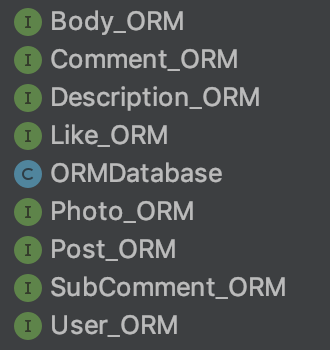
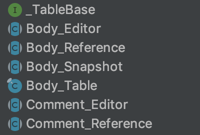
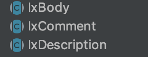
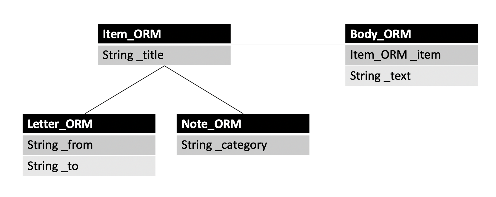

# Tutorial

In this tutorial, we will see how to use Storm through simple example.
database schema in this example is written assuming we are making SNS application.

### ORM model definition

To generate source, we first have to define ORM models

Classes above are ORM definitions for sample application and are declared in a package 'org.slowcoders.sample.orm.def'.
Details regarding how to define model will be explained in section 'Model'

### Database definition

Besides ORM definition, we need to create another class file that extends JDBCDatabase which defines database configurations
like file name and migrations. This class must be in the same package with ORM definitions.
Simply copy and paste code below will work fine for simple usage.

    public class ORMDatabase extends JDBCDatabase {
    
        private static ORMDatabase dbStorage = new ORMDatabase();
        private static final String dbName = "storm-test.db"; // name of database 
        private static final int dbVersion = 1; // database version
    
        private ORMDatabase() {
            super(dbName);
        }
    
        public static abstract class Table<SNAPSHOT extends EntitySnapshot, REF extends EntityReference, EDITOR extends EntityEditor>
                extends JDBCTable<SNAPSHOT, REF, EDITOR> {
    
            public Table(String tableName) {
                super(dbStorage, tableName);
            }
        }
    
        protected StormTable.AbstractEntityResolver createAbstractEntityResolver() {
            return new StormTable.AbstractEntityResolver() {
                @Override
                public StormTable<?, ?, ?> getTable(long id) {
                    return null;
                }
            };
        }
    
        public static void initDatabase() throws Exception { // this static method must be declared since it is generated in _TableBase interface
            try {
                dbStorage.init(dbVersion, migrations); // it is recommended to call init() method of database here
            }
            catch (Exception e) {
                e.printStackTrace();
            }
        }
    
        private static JDBCMigration[] migrations = new JDBCMigration[] { // migrations
    
        };
    
    }

Database class must define static method initDatabase() and call init() to initialize database. 
Init() method takes database version and array of migration as parameters.

AbstractEntityResolver is used in special cases when rowid is used to resolve table.
Details about AbstractEntityResolver will be explained in @TableDefinition in 'Model' section.  

### Source Generation

Source generation uses ORMGenerator class.

ORMGenerator generates two kinds of sources. 
One is storm classes which should not be modified because they will be regenerated once there is a change in ORM definitions.
The other is model classes that are free to modify. Model classes are generated only once when files do not exist in designated directory.

    public class GenORM extends ORMGenerator { 
    
        @Override
        public String getEntityBaseName(Class<?> ormDefinition) { // base name for storm classes
            String name = ormDefinition.getSimpleName();
            return name.substring(0, name.indexOf("_ORM"));
        }
    
        @Override
        public String getEntityModelName(Class<?> ormDefinition) { // name for model classes
            String baseName = getEntityBaseName(ormDefinition); 
            return "Ix" + baseName; // we will use "Ix" as prefix for model classes
        }
    
        public static void main(String[] args) {
            try {
                GenORM gen = new GenORM();
                gen.setSchemaPackage(
                        "ORMDatabase", // name of database class
                        "src/main/java", // directory of orm definitions
                        "org.slowcoders.sample.orm.def" // package name of orm definitions
                );
                gen.setModelOutput( // directory and package name for sources that will be generated
                        "src/main/java", "org.slowcoders.sample.orm.gen",
                        "src/main/java", "org.slowcoders.sample.orm.gen"
                );
    
                gen.generateORM(false); // generate source
            } catch (Exception e) {
                throw Debug.wtf(e);
            }
        }
    }

In ORMGenerator, we need to determine name for Storm classes and model classes by overriding 
methods getEntityBaseName() and getEntityModelName()

And finally we can generate sources.

...

...

Storm classes have been generated based on orm models we defined. 

### StormConfig

Last thing to do is to implement config class.
In PAL.Impl class, interface Storage and AsyncSchedule.Executor are defined that have to be implemented
to make use of Storm. Storage defines database file path and AsyncSchedule.Executor defines in which thread
notifications are sent.

    public class PAL {
        
        // ...
           
        public interface Impl {
            Storage getStorage();
    
            NPAsyncScheduler.Executor getAsyncExecutor();
    
            boolean isDebugVerbose();
    
            boolean isDebugMode();
        }
    }
    
Config class must be created in package 'org.slowcoders.pal' and name of class must be 'StormConfig'

There are config templates in [Configs]("https://github.com/slowcoders/mpbase/tree/master/src/pal)
In j2se folder, there is config for pc and in android folder, there is config for android so we can copy and paste config file 
and modify it based on our needs.
In default configs, it is implemented that notifications are sent by ui thread.

### Storm Classes

There are four main classes in Storm, **EntityReference**, **EntitySnapshot**, **EntityEditor**, **StormTable**.
These are all abstract classes and for each orm model, four implementations are generated which extend main classes. 
In our example, Body_Reference, Body_Snapshot, Body_Editor, and Body_Table were generated for Body_ORM,
which extends EntityReference, EntitySnapshot, EntityEditor, and StormTable respectively.

**EntityReference** 

Reference holds a rowid of item and with this rowid it can load and delete item.
Rowid is always unique and Storm internally caches all reference instances mapping each reference to its rowid.
Therefore, there can only be one reference instance for each item.

**EntityEditor**

Editor is a class used to make new item or modify existing item. 
Editor has set__() methods for each column defined and calling save() will write data to database.

**EntitySnapshot**

Snapshot holds data loaded from database and there are get__() methods for each column.
As name 'snapshot' implies, snapshot returns data that are of the time when snapshot is loaded and it always
returns same data no matter when data were requested. All data of snapshot are strictly managed to be immutable and 
snapshot does not have any methods that modify value. Data modification can only be done through editor.

**StormTable** 

All operations that need database access are done by StormTable. For example, when we call save() method of editor, editor requires related table
to save data. Table implementations generated by ORMGenerator are all statically defined in interface named '_TableBase'.

# Model

ORM model is defined by extending ORMEntity interface

    @TableDefinition(
            tableName = "tUser" // name of table
    )
    public interface User_ORM extends ORMEntity {
    
        // Declare columns
        ORMColumn EmailAddress = _Column("_emailAddress", Unique, // unique '_emailAddress' column with String type
                String.class);
    
        ORMColumn Name = _Column("_name", 0, // '_name' column with String type
                String.class);
    
        OuterLink Posts = _VolatileJoin("_posts", 0, // User_ORM is joined with Post_ORM. this is not an actual column. it's rather a meta data defining join relationship
                Post_ORM.class);

### @TableDefinition

    @TableDefinition(
            tableName = "tUser"
    				rowIdStart = // number for rowIdStart
    )

ORM models with @TableDefinition annotation are all created as table in database.
If there is an orm model whose sole usage is defining inheritance relationship,
we do not want table of this model to be created, so simply not defining TableDefinition will not make any unnecessary table.

TableDefinition annotation takes these parameters :

**tableName** - Table will be created under this name in database, and this name will also be used as variable name 
for statically declared table instance in '_TableBase' class

**rowIdStart** - For all tables, Storm automatically generates rowid column which records unique id of item, 
and rowIdStart defines from what number rowid starts. For instance, if rowIdStart is set to be 1_000_000, 
rowid in this table will start from 1_000_001. 
This additional feature can be used with abstractEntityResolve in database class.

Schema below is an example when rowIdStart can be used.

In the picture above, Letter_ORM and Note_ORM both inherit from Item_ORM and Body_ORM references Item_ORM as foreign key.
Since Storm supports inheritance between ORMEntity, _item foreign key in Body_ORM can be either Letter_ORM or Note_ORM.

Problem is because Letter and Note are different tables, we cannot know from which table to find foreign key item, Note or Letter.
To solve this, we can set rowIdStart for each Note and Letter table with numbers that can make rowids always unique in both
Note and Letter table.

    @TableDefinition(
            tableName = "tLetter",
            rowIdStart = 1000L * 1000 * 1000 * 1000 * 1000 * 100
    )
    public interface Letter_ORM extends ORMEntity {
    }

    @TableDefinition(
            tableName = "tNote",
            rowIdStart = 1000L * 1000 * 1000 * 1000 * 1000 * 100 * 2
    )
    public interface Note_ORM extends ORMEntity {
    }

If we set rowIdStart of Letter table to be 1000L * 1000 * 1000 * 1000 * 1000 * 100, 
and that of Note table to be 1000L * 1000 * 1000 * 1000 * 1000 * 100 * 2, 
there cannot be duplicate rowids between Note and Letter and therefore we can resolve which table _item points.
(It is important that difference between two rowIdStarts have to be large enough that there cannot be
 items with same rowid in any case)

We can make use of abstractEntityResolver as below : 

    protected StormTable.AbstractEntityResolver createAbstractEntityResolver() {
            return new StormTable.AbstractEntityResolver() {
                @Override
                public StormTable<?, ?, ?> getTable(long id) {
                    int v = (int) (id / MAX_ITEMS_PER_TABLE);
                    switch (v) {
                        case 1:
                            return _TableBase.tNote;
                        case 2:
                            return _TableBase.tLetter;
                        default:
                            return null;
                    }
                }
            };
        }

### @ModelDefinition

    @ModelDefinition(
            uniques = "_post, _user",
            indexes = "_post, _user"
    )

In @ModelDefinition we can define unique, index columns.

Uniques, indexes are all String[] type. In the code above, we defined _post and _user to be unique in one String.
This means that there can be more than one item with same _post or same _user,
but there cannot be more than one item whose _post and _user are both same.

### ORM model

    import static org.slowcoders.storm.orm.ORMFieldFactory.*;

    public interface User_ORM extends ORMEntity {

    	ORMColumn EmailAddress = _Column("_emailAddress", Unique,
                String.class);
    
        ORMColumn Name = _Column("_name", 0,
                String.class);
                
        OuterLink Photo = _SnapshotJoin("_photo", UnsafeMutable | Nullable,
                Photo_ORM.class);

        //...

ORM model can be defined by extending ORMEntity or other orm model.

ORMColumns are normal columns that will be created as column in table.

Besides ORMColumns, OuterLinks define join relationship and these are not actual columns so they will not be created as column in table.
In User_ORM we defined Photo_ORM as outerLink. This means that Photo_ORM references User_ORM as foreign key.

In most cases, columns take three arguments, name of column, flags, type of column.
From example above, it is recognizable that EmailAddress column will be created 
in user table with name "_emailAddress" and its type is String and this column will be unique.

### ORMFlags

We can also set additional attributes to columns by marking flags using constants in ORMFlags.

**Unique** - As its name implies, it makes column unique. 

**Nullable** - In Storm, it is not allowed to save null by default. If you want to set null, mark this flag.
If Nullable flag is not marked and type of column is Number or String, Number will be saved as 0 and String will be saved as empty String
when null is passed.

**UnsafeMutable** - In Storm, all data snapshot returns are strictly managed to be immutable. 
To preserve this concept, we forces other user-defined classes used as type of column to 
implement ImmutableEntity interface and override methods that are designed to follow Builder pattern. 
But there can still be some cases where inevitably mutable type has to be adapted (for instance, array). 
In this case, mark this flag and error will not be thrown. 

### ORMFieldFactory

In ORMFieldFactory interface, methods that return ORMColumn instances are defined.
Each method returns different type of columns. 

    	static ORMColumn _Column(String key, int flags, Class<?> columnType) { //.. }
    
    	static ORMAlias _Alias(ORMColumn column, int flags) { //.. }
    
    	static ORMColumn _List(String key, int flags, Class<?> columnType) { //.. }
    
    	static ORMColumn _Set(String key, int flags, Class<?> itemType) { //.. }
    
    	static ORMColumn _EnumSet(String key, int flags, Class<? extends Enum<?>> columnType) { //.. }
    
    	static ORMColumn _Map(String key, int flags, Class<?> keyType, Class<?> valueType) { //.. }
    
    	static ORMColumn _ForeignKey(String key, int flags, Class<?> columnType) { //.. }
    
    	static ORMColumn _MasterForeignKey(int flags, Class<? extends ORMEntity> columnType) { //.. }
    
    	static <T> ORMColumn _Generic(String key, int flags, Class<T> type, Class<?> genericParam, IOAdapter adapter) { //.. }
    
    	static ORMColumn _Embedded(String key, int flags, Class<? extends ORMEntity> columnType) { //.. }
    
    	static OuterLink _SnapshotJoin(String key, int flags, Class<? extends ORMEntity> columnType) { //.. }
    
    	static OuterLink _VolatileJoin(String key, int flags, Class<? extends ORMEntity> columnType) { //.. }

**_Column** - Normal Column

**_Alias** - This is an option when you want to use inherited column with different name

**_List**, **_Set**, **_EnumSet**, **_Map** - Returns column whose type is data structure

**_ForeignKey** - It defines foreign key relationship 

**_MasterForeignKey** - MasterForeignKey is mostly same with ForeignKey. Difference is that sub entity will have its rowid same with 
that of foreign key. It is an optimization option because using master foreign key, we do not have to make query for resolving foreign key entity.
MasterForeignKey can be used only when foreign key is unique.

**_Generic** - This column can be used when type of column is user-defined class. Fourth parameter of this method is instance of IOAdapter.
IOAdapter defines how to serialize and deserialize data.  

**_Embedded** - Type of this column must be ORMEntity, and that entity will be subordinate to this table, which means
embedded entity will be deleted when entity in this table is deleted.

**_Snapshot/VolatileJoin** - OuterLinks, which define join relationship, are not actual column so they are not created in table.
To complete join relationship, linked table must define _ForeignKey() with type being this orm model.

    public interface User_ORM extends ORMEntity {
    		
        OuterLink Photo = _SnapshotJoin("_photo", UnsafeMutable | Nullable,
                Photo_ORM.class);
    
    		//..

Inside User_ORM, there is OuterLink, defining SnapshotJoin relationship with Photo_ORM.
In SnapshotJoin, snapshot of sub entity is always that of the time when master entity snapshot is loaded.
For instance, we loaded user-1 snapshot and while we do some work with it, joined photo-1 has been changed. 
Even though data of photo-1 is updated, photo we can get from preloaded user snapshot is snapshot before update. 

    public interface User_ORM extends ORMEntity {
    
        OuterLink Description = _VolatileJoin("_description", 0,
                Description_ORM.class);
    
    		//...
    }
    
    public void function() {
    		IxUser.Snapshot user;
    		IxDescription ref = user.getDescription(); // returns reference of description 
    		IxDescription.Snapshot snapshot = user.peekDescription(); // returns snapshot of description
    }
    
On the other hand, in VolatileJoin, the only way to get snapshot of sub entity is to load it from sub entity reference
and because reference always returns recent version of snapshot, snapshots we can get are always up-to-date.
 
In the example above, getDescription() method in user snapshot returns reference of linked description.
Besides get__() methods, there are another methods whose name has "peek" as prefix and these methods directly return snapshot of sub entity.
But since these methods also internally load snapshot from reference, it is always recent version.

Marking unique flag in foreign key column decides relationship to be either one-to-one or one-to-many. 

    public interface Description_ORM extends ORMEntity {
    
        ORMColumn User = _ForeignKey("_user", Unique, // in foreign key, unique flag defines whether it is one-to-one or one-to-many
                User_ORM.class);
    		//..
    }
    
    public void function() {
    		//..
    		IxDescription descriptionRef = userRef.getDescription(); // user is joined with only one description
    }

In Description_ORM, foreign key is defined to be unique. 
When foreign key is marked to be unique their relationship becomes one-to-one,
thus from user reference, we can derive one description reference.

    public interface Post_ORM extends ORMEntity {
    
        ORMColumn User = _ForeignKey("_user", 0,
                User_ORM.class);
    		//..
    }
    
    public void function() {
    		//..
    		Post_Table.RowSet postRefs = userRef.getPosts();
    }

On the other hand, in case of Post_ORM, we did not mark unique flag for foreign key and this means their relationship is one-to-many.
So getPosts() method returns rowSet of posts. 

### Custom Queries

Custom queries are user-defined queries that will be generated in table class.
To make use of custom queries, we first have to declare interface with name "Queries" in orm definition class.
Then define queries inside "Queries" interface.

    interface Queries {
        @Where("_subject like {subject}") // define where clause
        StormRowSet findBySubjectLike(String subject); 
    
        @Where("_subject like {subject} GROUP BY _tag HAVING MAX(rowid)")
        StormRowSet findBySubjectLike_groupByTag(String subject);
    }

Code above is Queries interface in Post_ORM
To make custom query, we need to define @Where annotation with query string as parameter.
In example, we defined two query methods with name findBySubject() and findBySubject_groupByTag() and return type to be StormRowSet.
Return type can be three kinds.

**StormRowSet** - StormRowSet is used when result of query is expected to be more than one. StormRowSet has interfaces
 selectEntities() and loadEntities() which returns list of references and snapshots respectively.

**EntityReference** - It returns one reference as result. If actual results are more than one, it returns first.

**EntitySnapshot** - It returns one snapshot as result. If actual results are more than one, it returns first.

Defined query methods are created in table class after generating source and we can use it like below :

    Post_Table.RowSet posts = _TableBase.tPost.findBySubjectLike("%Post-1");

Join query can be defined like below :

    public interface User_ORM extends ORMEntity {
    
    	  //..
    
    		OuterLink Photo = _SnapshotJoin("_photo", UnsafeMutable | Nullable,
                Photo_ORM.class);
    
        interface Queries {
            @Where("@Photo._photoName LIKE {photoName}") 
            StormRowSet findByPhotoNameLike(String photoName);
        }
    }

### Model Class

In addition to base classes we have looked through like Editor, Reference, and Snapshot, 
ORMGenerator generates model classes.

    public abstract class IxPost extends Post_Reference {
    
    	protected IxPost(long id) { super(id); }
    
    	public static abstract class Snapshot extends Post_Snapshot {
    		protected Snapshot(IxPost ref) { super(ref); }
    	}
    
    	public interface UpdateForm extends IxPost_.UpdateForm {}
    
    	public static class Editor extends Post_Reference.Editor {
    		protected Editor(Post_Table table, Post_Snapshot origin) { super(table, origin); }
    	}
    }

Taking Post_ORM as example, above is model class of Post_ORM. (we defined "Ix" to be prefix of model class)
IxPost extends Post_Reference, IxPost.Snapshot extends Post_Snapshot, and IxPost.Editor extends Post_Editor.
This source will not be regenerated once it is created so it is free to extend features of this class.

    public abstract class IxPost extends Post_Reference {
    
    	protected IxPost(long id) { super(id); }
    
    	public static abstract class Snapshot extends Post_Snapshot {
    		protected Snapshot(IxPost ref) { super(ref); }
    	}
    
    	public interface UpdateForm extends IxPost_.UpdateForm {}
    
    	public static class Editor extends Post_Reference.Editor {
    		protected Editor(Post_Table table, Post_Snapshot origin) { super(table, origin); }
    
    		@Override
    		protected void onSave_inTR() throws SQLException, RuntimeException {
    			if (getOriginalData() == null) {  // added code
    				setCreatedTime(DateTime.now());
    			}
    			super.onSave_inTR();
    		}
    	}
    }

Some codes were added inside of IxPost.Editor class. In Post_ORM, there is a column named "CreatedTime" which records the time post is created.
We can just simply assign value to createdTime whenever we create post, but this could be somewhat annoying if there are too many places where post is created.
So instead, we added code for createdTime inside of onSave_inTR() method, which will be executed whenever post is saved. 
Now we do not have to copy and paste same code everywhere post is created. 
(new entity does not have originalData so we can distinguish whether it is create or update by checking if originalData is null)

# Query

### Query Snapshot From Reference

If we already have reference of item we wish to query, through loadSnapshot() method, we can derive snapshot.

    IxUser userRef;
    IxUser.Snapshot userSnapshot = userRef.loadSnapshot();
    String name = userSnapshot.getName();
    String emailAddress = userSnapshot.getEmailAddress();

Once loadSnapshot() method is called, reference query item with its rowid and make snapshot with results.
Queried snapshot is always cached in reference and as long as this item is not updated, cache is preserved, 
so until update occurs, loadSnapshot() returns same instance.

### Query Joined Entity

    IxPost postRef;
    
    IxUser userRef = postRef.getUser(); // get user reference which is foreign key of post
    IxUser.Snapshot userSnapshot = userRef.loadSnapshot(); // load snapshot of user
    
    Comment_Table.RowSet commentRowSet = postRef.getComments(); // get rowSet of comment which is sub entity of post. one-to-many relationship.
    ImmutableList<IxComment.Snapshot> commentSnapshots = commentRowSet.loadEntities(); // load snapshots

Code above is example of how to get joined entity from reference.

Post_ORM has User_ORM as foreign key and Comment_ORM as outerLink.
Simply calling get__() methods will return reference of joined entity.  

    IxPost.Snapshot postSnapshot;
    
    IxUser userRef = postSnapshot.getUser();
    
    ImmutableList<IxComment.Snapshot> commentSnapshots = postSnapshot.getComments(); // it is SnapshotJoined so get method returns list of snapshots.
    
    ImmutableList<IxLike> likeRefs = postSnapshot.getLikes(); // it is VolatileJoined so get method returns list of references.
    ImmutableList<IxLike.Snapshot> likeSnapshots = postSnapshot.peekLikes(); // in VolatileJoin, there is another method peek__() which returns list of snapshot.

Code above is example of how to get joined entity from snapshot.
Get method for foreign key returns reference. 
For sub entities, it depends on whether it is SnapshotJoin or VolatileJoin.

Post has one-to-many SnapshotJoin relationship with Comment and one-to-many VolatileJoin relationship with Like.
getComments() method will return list of comment snapshots.
getLikes() method will return list of like references, and if we want to directly get snapshots of likes, peekLikes() will return what we want.

### StormRowSet

In StormRowSet interface, methods are defined which return list of references or snapshots. 
Most representative class which inherits StormRowSet is table.

    ImmutableList<IxUser> userRefs = _TableBase.tUser.selectEntities(); // load list of user references
    ImmutableList<IxUser.Snapshot> userSnapshots = _TableBase.tUser.loadEntities(); // load list of user snapshots 

Calling selectEntities() from user table will return references of all items in table.

Method which is defined in Queries with their type being StormRowSet can also be used likewise.

    User_Table.RowSet rowSet = tUser.findByPhotoNameLike("%photo"); // we defined Queries method to return StormRowSet
    
    ImmutableList<IxUser> userRefs = rowSet.selectEntities();
    ImmutableList<IxUser.Snapshot> userSnapshots = rowSet.loadEntities();

### Unique Query

If there is unique column in orm model, method which finds item with unique column is generated in table class.

    public interface User_ORM extends ORMEntity {
    
        ORMColumn EmailAddress = _Column("_emailAddress", Unique,
                String.class);

In User_ORM, EmailAddress is defined to be unique by flag.
With generated email table class, we can query user reference with email.

    IxUser userRef = tUser.findByEmailAddress("slowcoder@ggg.com");
    
Because item is unique, it always returns one reference.

### Dynamic Query

If we want to make query by ourselves, we can do this way :

    String sql = "SELECT * FROM tUser WHERE _name IS NULL";
    
    StormQuery query = tUser.createQuery(sql,
          new SortableColumn[] {
    							// createSortableColumn
    							// 첫 번째 인자는 sort 할 칼럼이 속한 테이블
    							// 두 번째 인자가 true 이면 Ascent, false 면 Descent
                  User_ORM.EmailAddress.createSortableColumn(tUser, false) 
          }
    );
    
    ImmutableList<EntityReference> userRefs = query.selectEntities();
    ImmutableList<EntitySnapshot> userSnapshots = query.loadEntities();

Creating query can be done by calling createQuery() method of table that we want to query
It takes query String as first argument and second is sort option which takes array of SortableColumn.
SortableColumn can be derived from ORMColumn instance which is statically defined in orm definition.

### Delete item

We can delete item through reference.

    IxUser userRef;
    userRef.deleteEntity();

Above is example of deleting user through user reference. 
When deleting item, if this item has joined sub entities, 
sub entities will also be deleted in transaction automatically.

### Batch Update

Basically, update and delete can be done through editor and reference.

However, in case when large number of entities have to be updated or deleted, querying one entity at a time
can cause unnecessary overhead.

In this case, we can update or delete items in batch.

    ImmutableList<IxPost> postRefs = tPost.selectEntities();
    
    String updatedSubject = "updated subject"; // subject to update
    ColumnAndValue[] cvs = new ColumnAndValue[] {
            new ColumnAndValue(Post_ORM.Subject, updatedSubject, true) // columns to be updated and data
            // ... if there are more columns we want to update, add ColumnAndValue
    };
    tPost.updateEntities(cvs, postRefs);

Batch update can be done using ColumnAndValue which takes ORMField and String as arguments.

First argument is ORMColumn we want to update, and second is data we want to replace to.
(third argument decides whether to append quote or not. if column is String type, true has to be passed)

In the example above, we change subject of post.
After defining ColumnAndValue array, pass it to updateEntities() method with targets references 
then update will be executed at once for all references.

### Batch Delete

Batch delete is simpler. Simply calling deleteEntities() from target table passing references to delete
will delete all references at once. 

    tPost.deleteEntities(postRefs);

### Transaction

To query in transaction, we need to get database from table and call executeInLocalTransaction() method.
All queries in execute_inTR method() will be executed in transaction.

    tUser.getDatabase().executeInLocalTransaction(new TransactionalOperation<Void>() {
        @Override
        protected Object execute_inTR(Void operationParam, long transactionId) throws SQLException {
            IxUser userRef = tUser.selectFirst();
            ImmutableList<IxUser.Snapshot> userSnapshots = tUser.loadEntities();
            return null;
        }
    }, null);

# Write

### Create Item

Editing item is always done through editor.
Take post item as example :

    IxPost.Editor editPost = tPost.newEntity(); // get editor from newEntity() method
    editPost.setSubject("New Post"); // set values
    editPost.setCreatedTime(DateTime.now());
    editPost.save(); // save

Editor for creating new time can be derived from associated table. 
All tables defined have newEntity() methods and these return editor of which originalData is null (because it is new)
With derived editor, we can assign values with set__() methods and write to database by calling save() method. 

### Update Item

Editor for update can be derived from snapshot.

    IxPost.Snapshot postSnapshot = tPost.loadFirst(); // load snapshot of first item in post table.
    
    IxPost.Editor editPost = postSnapshot.editEntity(); // editor that modifies existing item.
    editPost.setSubject("Updated Subject");
    editPost.save();

editEntity() method of snapshot returns editor which contains current snapshot has originalData. Through this editor,
we can set values and write to database by calling save() method.

### Update Joined Item (one-to-one)

In joined relationship, editor of sub entity can be directly derived from editor of master entity.
Take Post as example :

    IxPost.Editor editPost = tPost.newEntity();
    editPost.setSubject("Example Post");
            
    IxBody.Editor editBody = editPost.editBody();
    editBody.setBody("New Body");
    editPost.save();

When join relationship is defined, edit__() method is generated in editor class of master entity which returns editor of sub entity.
We called editBody() from IxPost.Editor to get editor of Body.
Once edit__() method is called, if sub entity already exists, 
it returns sub entity editor that modifies existing item and if not, it returns editor for new item.

Note that we did not call save() method of IxBody.Editor. It is because when editing joined entities, calling save() method of 
editor in highest hierarchy will write all changes to database in transaction.

### Update Joined Item (one-to-many)

Below is example of how to edit sub entity which is joined in one-to-many relationship.

    IxUser userRef = tUser.selectFirst();
    IxPost.Editor editPost = tPost.newEntity();
    
    EditableEntities<IxComment.UpdateForm, IxComment.Editor> editComments = editPost.editComments();
    
    IxComment.Editor editComment = tComment.newEntity();
    editComment.setPost(editPost);
    editComment.setUser(userRef);
    editComment.setText("New Comment");
    
    editComments.add(editComment);
    
    editPost.save();

Post_ORM is joined with Comment_ORM in one-to-many.
editComments() method of IxPost.Editor returns EditableEntities which manages editors of sub entities.
In the example above, we created new comment and by calling EditableEntities.add() method, added comment.

Save() method of IxPost.Editor will save all changes including newly created comments in transaction.

It we add item which is already one of sub entities, it will not be added, but updated instead.

    EditableEntities<IxComment.UpdateForm, IxComment.Editor> editComments = editPost.editComments();
    
    IxComment.Editor editComment = editComments.edit(0);
    editComment.setText("Updated Comment");
    
    editPost.save();

Example above is how to update sub entity. 
We took editor of sub entity from index 0 and set new text and saved.

    EditableEntities<IxComment.UpdateForm, IxComment.Editor> editComments = editPost.editComments();
    editComments.remove(0);
    
    editPost.save();

Lastly, above is how to delete sub entity.
We took EditableEntities from post editor and delete sub entity which is in index 0.

### Save Joined Item

Like mentioned above, all changes of joined entities will be saved once save() method of highest editor in hierarchy 
is called.
Below is little more complicated example of editing joined entities. 

    IxUser.Editor editUser = tUser.edit_withEmailAddress(email); // user editor
    editUser.setName("slowcoder");
    
    IxDescription.Editor editDesc = editUser.editDescription(); // description editor which is joined with user
    editDesc.setText("hi, I like to code");
    
    IxPhoto.Editor editPhoto = editUser.editPhoto(); // photo editor which is joined with user
    editPhoto.setPhotoName("my photo");
    
    IxPost.Editor editPost = tPost.newEntity(); // editor for new post
    editPost.setUser(editUser);
    editPost.setSubject(subject);
    editPost.setCreatedTime(DateTime.now());
    
    IxBody.Editor editBody = editPost.editBody(); // body editor which is joined with post
    editBody.setBody(email);
    editUser.editPosts().add(editPost); // add new post to user
    
    IxComment.Editor editComment = tComment.newEntity(); // editor for new comment
    editComment.setUser(editUser);
    editComment.setText("Comment for " + subject);
    editComment.setPost(editPost);
    
    IxSubComment.Editor editSubComment = tSubComment.newEntity(); // editor for new subcomment
    editSubComment.setText("hi dude");
    editSubComment.setComment(editComment);
    editComment.setUser(editUser);
    
    editComment.editSubComments().add(editSubComment);
    editPost.editComments().add(editComment);
    
    IxLike.Editor likeEditor = tLike.edit_withPostAndUser(editPost, editUser); // like editor
    editPost.editLikes().add(likeEditor); // add new like to post 
    
    editUser.save(); // this will save all changes including sub entities

In the example, we are trying to edit complicatedly joined entities. The point is that
just calling save() method of user.editor will save all changes and this will all be executed in transaction.

### Get Editor With Unique Column

If there is unique column in orm model, additional method is generated in table class. 

    @ModelDefinition(
            uniques = {"_post, _user"}
    )
    public interface Like_ORM extends ORMEntity {
    
        ORMColumn Post = _ForeignKey("_post", 0,
                Post_ORM.class);
    
        ORMColumn User = _Column("_user", 0,
                User_ORM.class);
    
    }

Taking Like_ORM (it belongs to post, which is common feature in SNS application) as example, 
Like_ORM is defined to be unique on post and user.

    IxLike.Editor editLike = _TableBase.tLike.edit_withPostAndUser(postRef, userRef);

Generated method above returns editor instance of like. Since there can not be more than one like of which post and user are
both same, with passed parameters Storm finds item and if it exists, it returns editor that edits existing item,
if not, it returns editor that creates new item.

### Ghost Reference

In multithreaded environment, there is a chance that one thread tries to load snapshot which is already deleted by other thread.
It means that every time we try to load snapshot, we have to check if it is null, which can be painful.
In order to resolve this issue, Storm is designed to be able to load snapshot of deleted entity.

When an item is deleted, it is not removed from database right away, instead it still remains in database with its rowid turned into negative number.
Storm removes ghost items when reference is garbage-collected or application is restarted. Therefore, as long as ghost item is referenced,
data can always be loaded in runtime. However, ghost items cannot be edited, error is thrown when that happens.

For unique columns, we update values to null when item is deleted and cache these in memory, so that conflict does not occur when
new item with same unique values is created.

To adapt this concept, Storm makes view for each orm table which only reflects items with positive rowid. 
In most situations, item queries fetch data from view. If there is a need to query deleted items, actual tables whose name has
suffix "_rw" can be used.

### Update Conflict

In multithreaded environment, there is a chance that while one editor is editing item, editor in another thread edits same item and saves.
There is a method in editor which can help to decide what to do in this situation.

    public boolean isConflictUpdate(EntitySnapshot recent) {
        return true;
    }

Method above is defined in EntityEditor and it can be overrided. When editor saves its editing item, Storm checks if version of snapshot editor holds is 
recent, and if is not, isConflictUpdate() method is called to determine whether it has to be considered conflict or not. 
If method returns true, error will be thrown and if not, data will be overwritten.

# Observable

### Async/RealtimeObserver

There are two kinds of observers in Storm.
One is AsyncObserver, which sends notification in a thread which is decided in PAL configuration. 
The other one is RealtimeObserver, whatever thread executes database operations will send notification.

### TableObserver

If we register observer to table, whenever item in that table changes, we can receive notification.

    StormTable.Observer<IxPost> observer = noti -> {
        ChangeType type = noti.getChangeType(); // Create, Update, Delete, Move
        IxPost ref = noti.getEntityReference(); // reference of changed item
        long modifyFlag = noti.getModifyFlags(); // bit flags of updated columns. it is -1 when new item is created. 
    
        // we can compare modifyFlag with updateBit of column to see
        // which columns have been udpated
        if ((modifyFlag & Post_ORM.Subject.getUpdateBit()) != 0) {
            //...
        }
    };
    
    _TableBase.tPost.addAsyncObserver(observer); // register observer
    
    _TableBase.tPost.removeObserver(observer); // remove observer

Example above shows how to register observer to table. 
With observer being registered to post table, whenever any post is created, updated, or deleted, we receive notification. 
EntityChangeNotification which is passed as argument contains type of change, reference of changed item, and bit modifyFlags
from which we can figure out which columns are updated. 

Note) registered observers are all weak-referenced so they are always targets of garbage collection but 
still it is recommended to explicitly remove it when there is no more need to receive notification.

### ReferenceObserver

We can also register observer to reference.

    IxPost postRef = tPost.selectFirst();
    postRef.setAsyncObserver((ref, type) -> {
        
    });

Once we register observer to a reference, whenever this item changes, we receive notification.

### ObservableCachedEntities

ObservableCachedEntities is basically a list of items, but it manipulates list to be always up-to-date.
ObservableCachedEntities detects all changes of items within its filter boundary 
and it reflects changes to the list it is holding, so that item caches always mirror database. 

    ObservableCachedEntities.SnapshotList<IxPost.Snapshot> entities = new ObservableCachedEntities.SnapshotList();
    entities.bindFilter(tPost.orderBy(
            Post_ORM.CreatedTime.createSortableColumn(tPost, false)
    ));
    entities.addAsyncObserver(new ObservableCachedEntities.Observer() {
        @Override
        public void onDataChanged(ChangeType type, int index, int movedIndex, EntityReference entityReference) {
                    // if changeType is Move, parameter index is origianl index 
                    // and movedIndex is index after change.
                    // except for Move, movedIndex is always -1
        }
    
        @Override
        public void onEntireChanged() {
    				// whole list has been changed.
        }
    });
    
    IxPost.Snapshot snapshot = entities.get(0);

There are two Implementations of ObservableCachedEntities. One is ReferenceList and the other is SnapshotList and as their names imply,
they manage reference list and snapshot list respectively.
In the example above, we made ObservableCachedEntities.SnapshotList of post which will manage list of post snapshots.
Through bindFilter() method, we can determine a target to query, which is post table in this example.
ObservableEntities we created will update list whenever there is a change to post items. 
We can also register observer to it to get notifications on change.

Here is another example of making ObservableCachedEntities :
    
    ObservableCachedEntities.SnapshotList<IxPost.Snapshot> entities = new ObservableCachedEntities.SnapshotList<>();

    String str = "WHERE _subject LIKE '%post%'"; // query string
    StormQuery query = tPost.createQuery(str, null); // we created StormQuery by ourselves 
    StormFilter filter = new StormFilter(query); // make StormFilter to use it as filter in ObservableCachedEntities

    entities.bindFilter(filter.orderBy(
            Post_ORM.CreatedTime.createSortableColumn(tPost, false)
    ));
    entities.addAsyncObserver(new ObservableCachedEntities.Observer() {
        @Override
        public void onDataChanged(ChangeType type, int index, int movedIndex, EntityReference entityReference) {

        }

        @Override
        public void onEntireChanged() {

        }
    });

    IxPost.Snapshot snapshot = entities.get(0);

To utilize automatic sort by ObservableCachedEntities, sort options must be set with Storm api orderBy() which takes SortableColumns.
If we dynamically create raw query which contains order by clause like this :

    String str = "WHERE _subject LIKE '%post%' ORDER BY _createdTime"; // order by clause is inserted in raw query
    StormQuery query = tPost.createQuery(str, null);
    
It just refreshes the whole list whenever item is updated because it cannot resolve index of changed item, and notification we call
onEntireChanged() method.

    String str = "WHERE _subject LIKE '%post%'"; 
    StormQuery query = tPost.createQuery(str, null); 
    StormFilter filter = new StormFilter(query); 
    filter.orderBy(
        Post_ORM.CreatedTime.createSortableColumn(tPost, false) // set sort options here
    )

Better practice is to set sort options through orderBy() method like above.

Also, if column for sort option is nullable, it refreshes the whole list.

StormRowSet also has method which returns ObservableCachedEntities.
Take post table as example : 

    ObservableCachedEntities.ReferenceList<IxPost> entities = tPost.makeAsyncEntities();
    

# DB Migration

DB Migration is done when database is first initialized.
In database class, its method init() takes db version and migration array as arguments.

Migrations in array are executed in sequence and when all migrations are done, version of user database
will be updated to the version we passed as argument.

    public class ORMDatabase extends JDBCDatabase {
    
        public static void initDatabase() throws Exception {
            try {
                dbStorage.init(dbVersion, migrations);
            }
            catch (Exception e) {
                e.printStackTrace();
            }
        }
    
        private static JDBCMigration[] migrations = new JDBCMigration[] {
    
        };
    }

Below is a class which extends JDBCMigration class. A number passed to super() in constructor as argument is a version of migration.
For all migrations of which version is bigger than that of user database, method migrate() will be executed.

    public class Migration_V2 extends JDBCMigration {
    
        protected Migration_V2() {
            super(2);
        }
    
        @Override
        protected void migrate(JDBCDatabase db) throws SQLException {
            String sql = null;
            PreparedStatement stmt = db.getConnection().prepareStatement(sql);
            stmt.executeUpdate();
        }
    }
